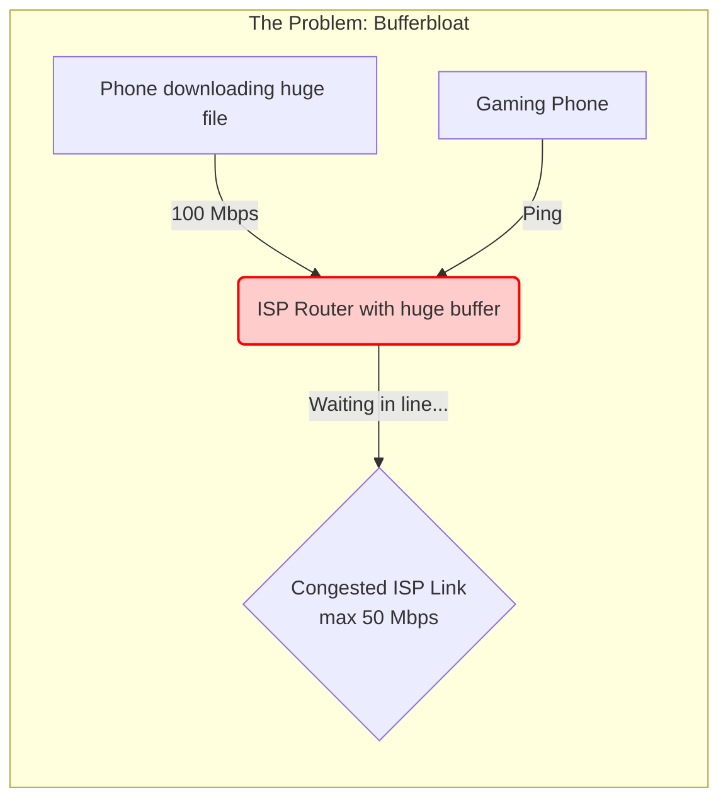
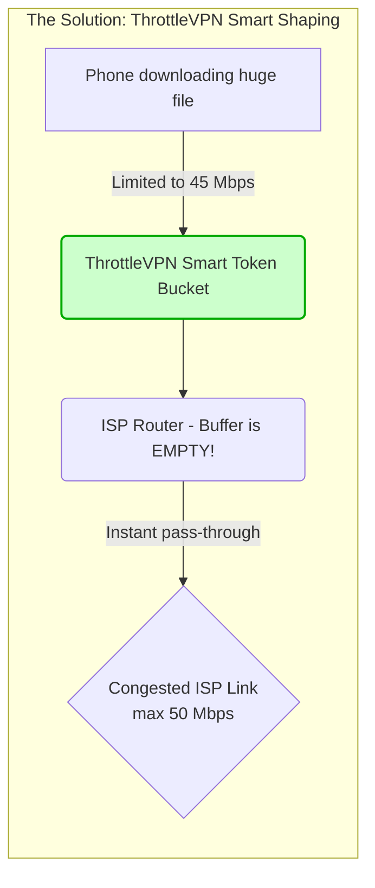
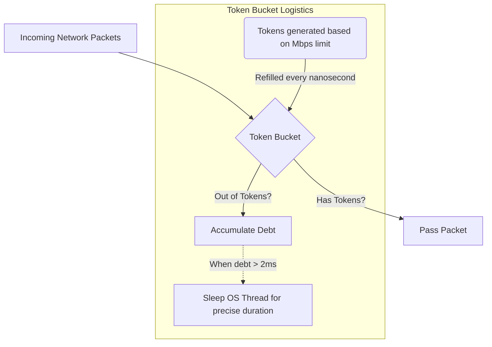
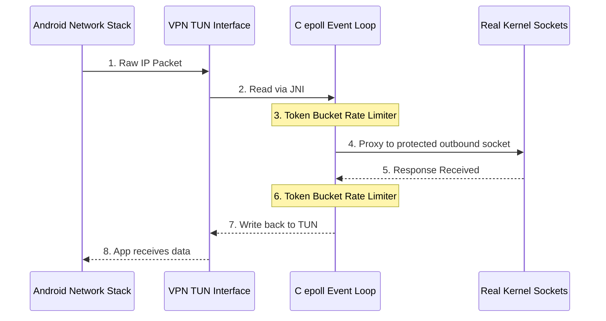

# ThrottleVPN

ThrottleVPN is a high-performance Android VPN application that intercepts device traffic to apply custom, precise upload and download bandwidth throttling (rate-limiting). 

Beyond just saving data, ThrottleVPN's primary superpower is **eliminating Bufferbloat** on congested networks, drastically improving gaming and real-time latency.

---

## 🛑 What is Bufferbloat?

When your home router or ISP gets overwhelmed with data (like when someone is downloading a large file), instead of dropping excess packets, modern routers queue them up in massive memory buffers. 

This means a tiny ping packet for your video game gets stuck in a line behind megabytes of download data. The result? Your ping spikes from 20ms to 500ms+, causing massive lag.

## 🚀 How ThrottleVPN Fixes Bufferbloat

ThrottleVPN fixes this by moving the bottleneck away from your ISP's bloated router and onto your phone, where we can manage it intelligently. 

By running ThrottleVPN and setting your speed cap to **~90% of your ISP's maximum speed**, your phone never sends or requests data fast enough to fill the ISP's buffer. The queue never forms, and your ping remains rock solid.

---

## ⚙️ The Throttling Engine: How it Works

Under the hood, ThrottleVPN uses a custom, highly optimized Native C engine (`tun2socks_engine.c`) that bypasses Java/Kotlin completely for network I/O.

### 1. The Token Bucket Algorithm
To enforce speed limits smoothly, we use a custom **Token Bucket Rate Limiter** with nanosecond precision.

- **Nanosecond Precision:** Tokens are refilled precisely based on the system's monotonic clock, avoiding "step" functions or stuttering.
- **Small Packet Priority (QoS):** The engine detects small packets (like TCP ACKs and SYNs often used in gaming) and charges them a "discounted" token rate. This ensures control packets slip through even when bulk downloads are being heavily throttled.
- **Batched Micro-sleeping:** Android's thread scheduler cannot reliably sleep for less than 2 milliseconds. If our engine calculates we need to delay a packet by 100 microseconds, we don't ask the OS to sleep (which would cause a 5ms jitter and ruin throughput). Instead, we batch the debt until it crosses a 2ms threshold, bypassing OS limitations and enabling flawless gigabit scaling.

### 2. Architecture Diagram

